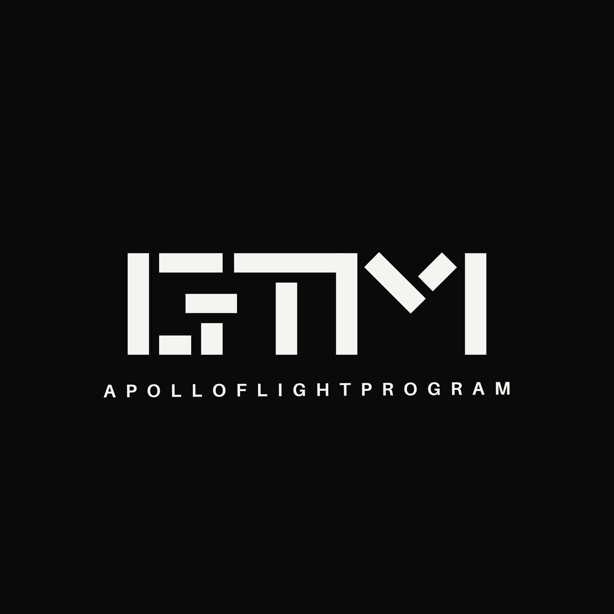

# GrandTheftMeta

<p align="center">
  
</p>

> **Built by Andrometall — FiveM Asset Development Studio** ·
> [Join the Discord](https://discord.gg/BrXbYWKvrM)

A **GTA V FiveM Advanced Meta Editor** — a desktop `.meta` file studio for GTA V / FiveM
vehicle & weapon resources, built with **Tauri v2 + React + Vite + TypeScript**.

Point it at any folder of vehicle/weapon resources (any layout). It auto-discovers the `.meta`
files (file names vary wildly in the wild, so matching is **content-driven**), scans every
editable entry, shows them in a searchable/sortable table, and writes your edits **surgically
back into the original files** — preserving formatting, comments and untouched parameters.

Two ways to edit every meta kind: a **Bulk Editor** (one row per entry, all parameters in a
virtualised grid) and a **Single Editor** (one entry at a time, grouped by module). A full
**Glossary** view explains every parameter, and the same text powers per-cell "?" hints.

## Navigation — two workshops under one roof

The app is split into **global sections** (top navbar) and a **contextual secondary navbar** that
changes with the active section:

| Global section | Secondary navbar | What it is |
| --- | --- | --- |
| **Home** | *(none — info only)* | What the app is, the two workshops, how it works |
| **Meta Workshop** | Workspace · Glossary · Dashboard | Everything that edits `.meta` files |
| **Asset Workshop** | Workspace · Glossary | Everything that inspects/creates assets |

`Meta Workshop → Workspace` is the editor grid (the sidebar is the meta-kind list).
`Asset Workshop → Workspace` is the tool rail on the left plus the active tool's workspace — the
rail holds the **UV Map Generator**, **Weapon Templates** and the **Weapon Generator** (see below);
`Asset Workshop → Glossary` is an intentional placeholder.

`src/ui/Navbar.tsx` owns `AppSection = "home" | "meta" | "asset"`; `src/ui/SubNavbar.tsx` renders
the contextual items passed in by `App.tsx` (`MetaView`, `AssetView`), so adding a view to a
workshop is one entry in a list there.

## Editors (v0.2.0 — all live)

| Category | Meta file | What one row is |
| --- | --- | --- |
| Vehicles | handling.meta | one `CHandlingData` (multi-entry fleets → one row per entry) |
| Vehicles | vehicles.meta | one vehicle model (`modelName`) |
| Vehicles | carcols.meta | one mod part / colour / list item |
| Vehicles | carvariations.meta | one variation / colour / livery / plate row |
| Vehicles | vehiclelayouts.meta | one seat / entry point / extra point |
| Vehicles | vehicleweapons.meta | one mounted weapon / ammo / weapon-data entry |
| Vehicles | weaponarchetypes.meta | one vehicle-mounted weapon model archetype |
| Weapons | weapons.meta | one `CWeaponInfo` firearm |
| Weapons | weaponanimations.meta | one personality-set × weapon animation entry |
| Weapons | weaponarchetypes.meta | one firearm weapon model archetype |
| Weapons | pedpersonality.meta | one weapon→clip binding (unholster / clip-set) |

## Asset Workshop

The tools live behind `Asset Workshop → Workspace`. Tools are additive: one entry in
`app/src/features/creator/tools.tsx` registers a new one, and the rail in
`features/creator/CreatorToolsView.tsx` picks it up.

### Weapon Tools — templates, one weapon, or a whole pack

The weapon side of the workshop turns a folder of streamed `.ydr`s into a **drop-in FiveM weapon
resource**: the **Weapon Templates** tool lists the base weapons you can clone from (derived from
your own metas, read-only), and the **Weapon Generator** clones one — retargeting every weapon
reference, generating `weaponarchetypes.meta` from your streamed models, wiring components and
per-bone **attachment slots**, and writing the resource. **Pack mode** does the same for N weapons
at once into **one** resource (one manifest, one label list, one folder per weapon, duplicate ids /
slot orders / component owners detected and slot orders allocated for you). Nothing is written until
you press Write, the writer refuses while a conflict remains, and the editor state can be saved and
loaded as a JSON preset.

**Full guide: [`docs/weapon-pack-generator.md`](./docs/weapon-pack-generator.md)** — the card-by-card
walkthrough, the output layout, the rules the generator follows (narrow rename surface, one slot per
bone, how duplicates are judged) and the conflict-vs-warning table.

### UV Map Generator (livery templates)

Import a GTA V drawable/fragment (**`.ydr`** / **`.yft`**) and get a **paint-ready livery template**
plus the model to check it against. The resource is parsed directly — no CodeWalker/OpenIV export
step and no Blender round-trip — and the file is **read-only**: nothing is ever written back.

Three workbenches, one click apart:

| View | What it is |
| --- | --- |
| **Template** | White islands on transparency, one pixel block per texture tile, cage on top — the file you paint on |
| **Model** | The model projected front / side / top / rear, depth-buffered, islands in their template colours |
| **Split** | Both side by side, so you can see which part you are painting |

- **UV targeting** is what turns a dump of every UV into a usable template: *All* materials, *Paint*
  (paint / livery / sign / decal shaders only) or a single material — plus a UV-channel filter for
  models that ship `TexCoord0` and `TexCoord1`. Clicking a part in the model view targets its
  material, and the marker list is the include/exclude set.
- **Cage**: the mesh drawn over the paint area — island borders (UV seams) or every triangle edge.
- **Tile-aware sizing**: the asset's own texture tiles are detected (many aircraft are `1 × 2`, not
  `1 × 1`), so a 2048 px tile exports 2048 × 4096 and lines up with the `.ytd`.
- Also exports a **colour reference** (one colour per island, a key for which island is which part).
- Gen8 / legacy resources (version `0xA2` / `0xA5`) are supported. GTA V Enhanced (**gen9**)
  drawables use a different vertex layout; they are detected and reported rather than mis-parsed.
  `.ydd` dictionaries are listed as unsupported for now.

- Reads the RSC7 container (system/graphics blocks), walks fragment → drawable → LOD models →
  geometries, decodes each `VertexDeclaration` to find the texture-coordinate channel, and pulls
  the UVs (`f16x2` or `f32x2`) plus the triangle index buffer.
- **Template view**: solid white islands over the asset's own texture tiles with the **cage** on top,
  at one pixel block per tile (so it lines up with the `.ytd`); the tile grid is a preview aid and
  is never baked into the export.
- **Sheet size is detected, not assumed**: many assets lay their UVs out over several tiles (the
  A-7 Corsair puts 77 % of its triangles in the `V 1–2` tile and only 9 % on the `0–1` tile), so the
  tiles covering ~90 % of the triangles are found by mass and framed together.
- **Model view**: the model projected **front / side / top / rear**, rendered by a small WebGL
  renderer with a real **depth buffer** (a painter's algorithm cannot do this — a UV island can
  span both sides of a model, so its far half paints over the near half of the next one and the
  shape turns into an unreadable pile). Every triangle is filled with the colour of the island it
  belongs to, optionally faded by depth; clicking a panel picks the island with a GPU id pass
  (pixel-exact) and targets its material. Exports as one PNG too.
- **Livery targeting**: materials whose shader name looks like a paint / livery / sign / decal
  layer carry a **livery** badge and the **Paint** target keeps only those (a `.yft` exposes shader
  names, not texture file names, so this is a name heuristic — the actual `*_sign_*.ytd` lives in
  the texture dictionary, which is not read yet).
- **Export**: template PNG (cage baked if enabled), colour reference PNG, and the 4-panel model
  guide; 1024 / 2048 / 4096 px per tile, adjustable padding, cage width and cage style.
- Gen8 / legacy resources (version `0xA2` / `0xA5`) are supported. GTA V Enhanced (**gen9**)
  drawables use a different vertex layout; they are detected and reported rather than mis-parsed.
  `.ydd` dictionaries are listed as unsupported for now.

## Features

- **Content-driven smart scanning** — file names aren't trusted; XML shape + content decides.
  Works with `handling_polmav.meta`, per-weapon `pedpersonality.meta` folders, merged files, etc.
- **Two editors per meta** — **Bulk** (all entries × all params in one grid) and **Single**
  (one entry at a time with grouped fields). Modified cells highlight yellow; edits are overlays
  until you click **Update Files**.
- **Always-text values** — flags/hashes/hex are never coerced to numbers, so `C201081` and
  `0x00FFFFFF` are never corrupted. Empty edited cells are never written.
- **Surgical comment-aware write-back** — edits resolve entries by structural path against the
  raw text (commented-out blocks never shift item indexes) and patch only the changed values.
- **Filter / sort / search** on every editor (text + native Type/Class or Kind/Set dropdowns).
- **Glossary view** — a parameter glossary for **every** meta (Vehicles + Weapons), registry-
  driven, searchable. Handling entries show the full original explanation (incl. flag tables) with
  a plain-language ↑/↓ summary on top.
- **In-editor hints** — every cell's "?" popover shows the same plain-language guide.
- **Creator Tools** (Asset Workshop) — asset utilities in their own section: the **UV Map
  Generator** turns a `.ydr` / `.yft`'s vertex buffers into an exportable UV sheet, and projects
  the model front / side / top / rear as a clickable **orthographic livery guide** (per-island
  colours, LOD filter, islands/wireframe/seam, 128–8192 px, transparent background option).
- **Weapon pack generator** (Asset Workshop) — catalogue your base weapons, then clone one into a
  new add-on weapon or queue a whole pack: ids retargeted, archetypes generated from the streamed
  models, components wired into per-bone attachment slots, slot orders allocated, one manifest and
  one label list for the resource. Dry-run plan first, conflicts block the write, JSON presets.
- Dark dev-tool UI with an orange accent.

## Stack

| Layer | Tech |
| --- | --- |
| Desktop | Tauri v2 (Rust) |
| Frontend | React 18 + TypeScript + Vite |
| Styling | Tailwind CSS v3 |
| Table | TanStack Table v8 + TanStack Virtual |
| XML | `quick-xml` (scan) + custom comment-aware text nav (write) |

## Development

The application lives in `app/` (frontend `src/` + Rust backend `src-tauri/` together).

```bash
cd app
npm install          # first time only
npm run tauri dev    # run with HMR (browser preview at :1420 via ?demo / ?dv / ?dc / ?cv / ?vl / ?vw / ?wa / ?wp / ?pp / ?uvdemo / ?wtdemo / ?wggen)
npm run tauri build  # produce installer
```

> Requires Rust (rustup, stable MSVC toolchain) + Node 18+.
> On Windows, double-click `dev.bat` at the repo root — it sets up the Rust `PATH` and starts `app/`.

## Project layout (where things live)

- `app/src-tauri/src/commands/*.rs` — one scan/write module per meta (handling, vehicles, carcols,
  carvariations, vehiclelayouts, vehicleweapons, weaponanimations, weaponarchetypes,
  pedpersonality) + shared `scan.rs` (XML→DOM), `textnav.rs` (comment-aware path navigation **and
  the creation primitives** `clone_item` / `insert_element` / `clear_children` / `retarget_identifiers`),
  `update.rs` (surgical patchers), `pick.rs` (folder dialog), `uvmap.rs` (drawable reader),
  `weapontemplates.rs` (base-weapon catalogue) and `weapongen.rs` (weapon generator + pack mode +
  presets). Register each module in `commands/mod.rs` + `lib.rs`.
- `app/src/App.tsx` — panel registry: `PanelId` union, `PANELS` config, one `useMetaDomain` per
  meta, dev demo effects (`?X` query params).
- `app/src/features/handling/` — shared editors (`VehicleTable`, `SingleHandlingEditor`,
  `ValueEditorDialog`, `GlossaryView`), demo data, and `glossaries/` (per-meta glossary modules +
  registry + plain-language handling guide).
- `app/src/features/creator/` — Creator Tools hub (`tools.tsx` registry, `CreatorToolsView`) and
  one folder per tool; `uv/` holds the UV Map Generator (`UvMapGenerator.tsx`,
  `uvRender.ts` sheet canvas/PNG engine, `guideRender.ts` guide geometry + layout,
  `guideGl.ts` depth-buffered WebGL renderer, `demoUv.ts` `?uvdemo` fixture), `weapons/` holds the
  weapon tools (`WeaponTemplatesView.tsx`, `WeaponGeneratorView.tsx` + `demoWeaponTemplates.ts` /
  `demoWeaponGenerator.ts` fixtures).
- `docs/` — end-user guides (e.g. `weapon-pack-generator.md`).
- `app/dev/guide-harness.html` — renders the guide once from dumped JSON documents without the
  app shell (browsers pause `requestAnimationFrame` in a background tab, so this is also the way to
  eyeball the renderer headlessly).
- `app/src/ui/` — Sidebar (categories → Single/Bulk), Toolbar, StatusBar, Navbar, Toast, FilterBar.
- `assets/` — brand images; `Dev-Notes/` — private/internal notes (gitignored, never published).

## Tauri commands (Rust ↔ JS)

Per-meta pattern (X = meta): `scan_X(folderPath) → ScanResult { vehicles, columns, skipped }`,
`update_X_files(folderPath, changes) → UpdateResult`, plus `pick_folder()`. The generic list-style
metas reuse a shared scanner/writer engine (`carcols.rs` `collect_list_rows` /
`update_list_files_generic`).

Creator Tools add `pick_resource_file()` (drawable/fragment file dialog),
`load_uv_document(path) → UvDocument { meshes[{ uvs, indices, lod, shader, … }] }` and
`load_vertex_positions(path) → PositionDocument { meshes[{ positions, … }] }`, all in
`commands/uvmap.rs`. Positions come from a second pass on purpose: coordinates roughly double the
payload, and only the orthographic guide needs them.

The weapon tools add `analyze_weapon_templates(folder) → WeaponTemplateCatalog`
(`commands/weapontemplates.rs`) and, in `commands/weapongen.rs`:
`scan_weapon_assets(folder) → WeaponAsset[]`, `preview_weapon_export(spec, out) → ExportPlan`,
`preview_weapon_pack(pack, out) → PackPlan`, `write_weapon_pack(pack, out, overwrite) → PackWriteReport`,
`save_weapon_preset(weapons, outFolder, path)` and `load_weapon_preset(path) → WeaponPreset`.

## Testing

- Rust unit tests per module (comment-tolerance included) + `#[ignore]` real-pack e2e tests
  gated behind `GT_TEST_*` env vars (MBO/GGC packs): `cargo test --lib` and
  `cargo test --lib -- --ignored --nocapture`. The weapon generator has its own set
  (`GT_TEST_WPN_TEMPLATES` / `GT_TEST_WPN_FIXTURE` / `GT_TEST_WPN_ASSETS` / `GT_TEST_WPN_HANDMADE`,
  see `docs/weapon-pack-generator.md` §7).
- Frontend: `npm run build` (tsc strict + vite).

## Building a release

```bash
cd app
npm run tauri build
```

Type-checks + bundles the frontend, compiles a Rust **release** build and produces installers under
`app/src-tauri/target/release/bundle/`:

```
nsis\GrandTheftMeta_<version>_x64-setup.exe    ← double-click installer
msi\GrandTheftMeta_<version>_x64_en-US.msi     ← MSI
```

Bump the version in **three** places before a release: `app/package.json`,
`app/src-tauri/tauri.conf.json`, `app/src-tauri/Cargo.toml` (`Cargo.lock` updates on build).
On Windows the bundler auto-fetches NSIS/WiX; no code-signing cert is configured, so SmartScreen
warns "unknown publisher" until you add one.

## Publishing (open source)

This repo is open source (GPL-3.0). Releases are published from `main`:

```bash
git push origin main
git tag v0.2.0 && git push origin v0.2.0
gh release create v0.2.0 `
  "app\src-tauri\target\release\bundle\nsis\GrandTheftMeta_0.2.0_x64-setup.exe" `
  "app\src-tauri\target\release\bundle\msi\GrandTheftMeta_0.2.0_x64_en-US.msi" `
  --repo yossebastiands/GrandTheftMeta --title "GrandTheftMeta v0.2.0" --notes "..."
```

A committed `.github/workflows/release.yml` can build + attach installers on GitHub Actions
instead. `gh` CLI is authenticated as `yossebastiands` on this machine.

## Contributing

Contributions are welcome! See [CONTRIBUTING.md](./CONTRIBUTING.md) for setup, code style, and
how to open a pull request.

## License

Distributed under the [GNU General Public License v3](./LICENSE).

---

<p align="center">
  <br/>
  Built by <strong>Apollo Flight Program — FiveM Asset Development Studio</strong> ·
  <a href="https://discord.gg/BrXbYWKvrM">Join the Discord</a>
</p>
